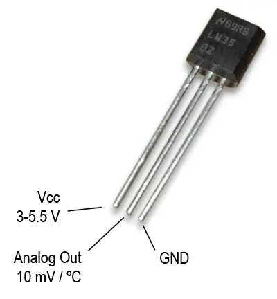
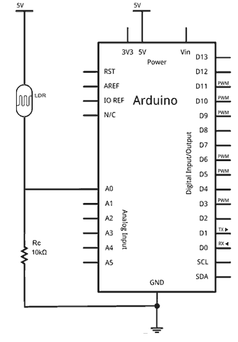
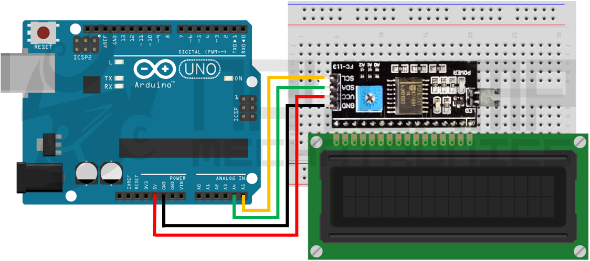

# Estación meteorológica doméstica

En este proyecto, construiremos una estación meteorológica doméstica que nos permitirá medir la temperatura, la humedad y la luz ambiental. Los datos se mostrarán en una pantalla LCD 16x2 utilizando el bus I2C, y si la temperatura supera un umbral predefinido, se activará un abanico representado por un servo motor.

## Explicación

Nuestra estación meteorológica utiliza un sensor DHT11 para medir la temperatura y la humedad, un sensor LM35 para obtener una segunda lectura de temperatura, y un LDR (resistor dependiente de luz) para medir la luminosidad ambiental. Los datos se procesan en el microcontrolador y se muestran en una pantalla LCD. Además, un potenciómetro permite al usuario establecer la temperatura deseada, que también se muestra en la pantalla LCD, y si la temperatura medida supera este valor, se activa un servo motor que simula el funcionamiento de un abanico.

Además, se utiliza un LED amarillo para indicar que la estación está encendida, y un LED RGB para indicar el estado de la temperatura: rojo si la temperatura supera la deseada y azul si está por debajo.

## Componentes necesarios

* Arduino Uno o similar
* Sensor de temperatura y humedad DHT11
* Sensor de temperatura LM35
* LDR (resistor dependiente de luz)
* Potenciómetro
* Servo motor
* Pantalla LCD 16x2 con interfaz I2C
* LED RGB
* LED amarillo
* Resistencias (4 de 220 para los LEDs + 1 de 10k$\Omega$ para el LDR) y cables de conexión

## Conexiones Arduino

Es importante conectar correctamente los componentes. Para ello, consultaremos los diagramas de pines de cada sensor y actuador. A veces, los pines vienen indicados en el propio componente, pero si no es así, podemos buscar el diagrama de pines **del mismo modelo** en Internet.

### DHT11

Se conecta el pin de datos del DHT11 al pin digital 2 del Arduino, el pin VCC a 5V y el pin GND a GND.

### Potenciómetro

Se conecta el pin central del potenciómetro al pin analógico A0 del Arduino, el pin VCC a 5V y el pin GND a GND.

### LM35

Se conecta el pin de salida (central) del LM35 al pin analógico A1, el pin VCC a 5V y el pin GND a GND.



### LDR

El LDR funciona como un divisor de tensión. Se conecta un extremo del LDR a 5V, el otro extremo al pin analógico A2 y a GND a través de una resistencia de 10k$\Omega$.



### LCD 16x2 con interfaz I2C

Se conecta el pin SDA del módulo I2C al pin A4 del Arduino, el pin SCL al pin A5, el pin VCC a 5V y el pin GND a GND.



### LED RGB

Como siempre, cada LED necesita una resistencia limitadora de corriente que suele ponerse entre el pin del Arduino y el ánodo del LED. En el caso de los LEDs RGB, cada color tiene su propio ánodo, por lo que necesitaremos 3 resistencias de 220$\Omega$ (una para cada color). El cátodo común se conecta a GND. Hay que tener en cuenta que algunos LEDs RGB tienen el cátodo común y otros el ánodo común, por lo que es importante verificar el tipo de LED que estamos utilizando.

Para formar distintos colores, se pueden mezclar los colores básicos (rojo, verde y azul) encendiendo los LEDs correspondientes con mayor o menor intensidad. El código proporcionado en este proyecto proporciona una función para encender el LED RGB en diferentes colores.

## Código de Arduino

El código completo se encuentra en el archivo [estacion.ino](./estacion.ino). A continuación, se muestran los fragmentos más importantes del código principal:

```cpp
// Importación de librerías necesarias
#include <DHT11.h> // para el sensor de temperatura y humedad DHT11
#include <LiquidCrystal_I2C.h> // para la pantalla LCD 16x2 con interfaz I2C
#include <Servo.h> // para controlar el servo motor

DHT11 dhtSensor(DHT_PIN);
LiquidCrystal_I2C lcd(0x27, 16, 2); 
Servo miServo;

void setup() {
  Serial.begin(9600);
  pinMode(R_LED, OUTPUT);
  pinMode(G_LED, OUTPUT);
  pinMode(B_LED, OUTPUT);
  pinMode(ON_LED, OUTPUT);

  miServo.attach(SERVO);

  lcd.init();
  lcd.backlight();

  digitalWrite(ON_LED, HIGH);

  // Registro de caracteres especiales para LCD (emojis) en la memoria CGRAM (0 a 4)
  lcd.createChar(0, termometro);
  lcd.createChar(1, gota);
  lcd.createChar(2, corazon);
  lcd.createChar(3, sol);
  lcd.createChar(4, simboloGrados);
}

void loop() {
  float t = temperaturaHumedad(); // lectura+escritura DHT11 y LM35
  float td = temperaturaDeseada(); // lectura+escritura potenciómetro
  if (t>td) { // si la temperatura real cae por debajo de la deseada, activamos el abanico del servo y el LED RGB en rojo
    abanicar_con_servo();
    rgb_color("rojo");
  } else {
    rgb_color("azul");
  }
  luminosidad(); // lectura+escritura LDR
  delay(1000); // cada segundo (un poco más si se abanica), se vuelven a leer los sensores y actualizar la pantalla LCD
}

void abanicar_con_servo() {
  for (int i=0; i<10; i++) {
    if (i%2==0) {
      miServo.write(180); 
    } else {
      miServo.write(0); 
    }
    delay(200);
  }
}

float temperaturaHumedad() {
  // 1. Lectura DHT11
  int dhtTemp = 0;
  int dhtHum = 0;
  dhtSensor.readTemperatureHumidity(dhtTemp, dhtHum);

  // 2. Lectura LM35 con referencia interna de 1.1 V
  analogReference(INTERNAL);
  analogRead(LM35); // Lectura de descarte para estabilizar ADC tras cambio de referencia
  delay(10);
  
  long sumaLM35 = 0;
  for (int i = 0; i < 10; i++) {
    sumaLM35 += analogRead(LM35); // media de 10 lecturas
    delay(2);
  }
  float readingLM35 = (float)sumaLM35 / 10.0;
  float lm35Temp = (readingLM35 * (1100.0 / 1024.0)) / 10.0; // transformación de voltaje a temperatura en ºC

  // Cálculo de temperatura media de los dos sensores (DHT11 y LM35)
  float tempMedia = (lm35Temp + (float)dhtTemp) / 2.0;

  // Actualización TºC y H% en LCD
  // Fila 0: [Termometro] TempMedia°C  [Gota] Humedad%
  lcd.setCursor(0, 0);
  lcd.write(byte(0)); // Termómetro
  lcd.setCursor(2, 0);
  if (tempMedia < 10.0) lcd.print(" "); // si es un único dígito, añadimos un espacio para alinear con el resto de números
  lcd.print(tempMedia, 1);
  lcd.write(byte(4)); // Símbolo de grado °
  lcd.print("C");

  lcd.setCursor(10, 0);
  lcd.write(byte(1)); // Gota
  if (dhtHum < 10) lcd.print("  ");
  else if (dhtHum < 100) lcd.print(" ");
  lcd.print(dhtHum);
  lcd.print("% ");

  return tempMedia;
}

float temperaturaDeseada() {
  analogReference(DEFAULT);
  analogRead(POTENC); // Lectura de descarte para estabilizar ADC a 5 V
  delay(10);

  int potVal = analogRead(POTENC);
  float temp_deseada = obtenerTemperatura(potVal);

  // Fila 1 izquierda: [Corazon] TempDeseada°C  [Sol]
  lcd.setCursor(0, 1);
  lcd.write(byte(2)); // Corazón
  lcd.setCursor(2, 1);
  if (temp_deseada < 10.0) lcd.print(" ");
  lcd.print(temp_deseada, 1);
  lcd.write(byte(4)); // Grado °
  lcd.print("C");

  return temp_deseada;
}

void luminosidad() {
  int ldrVal = analogRead(LDR_PIN);
  int luzPorcentaje = map(ldrVal, 0, 1023, 0, 100);
  luzPorcentaje = constrain(luzPorcentaje, 0, 100);

  // Fila 1 derecha: [Sol] Luz%
  lcd.setCursor(10, 1);
  lcd.write(byte(3)); // Sol
  if (luzPorcentaje < 10) lcd.print("  ");
  else if (luzPorcentaje < 100) lcd.print(" ");
  lcd.print(luzPorcentaje);
  lcd.print("% ");
}

float obtenerTemperatura(int x) { // mapea el valor del potenciómetro (0-1023) a un rango de temperatura deseada (10, 10.5, 11, ..., 31, 31.5, 32)
  int indice = map(x, 0, 1023, 0, 44);
  return 10.0 + (indice * 0.5);
}
```

## Aplicación real

Aunque en este ejemlpo simulado, el servo representa un abanico como solución al aumento de temperatura por encima dela deseada, en una aplicación real, se podría utilizar un módulo de relé para activar un ventilador real cuando la temperatura supere el umbral deseado. Otra opción sería utilizar un sistema de calefacción si la temperatura cae por debajo del valor deseado. La estación meteorológica podría integrarse en un sistema domótico más amplio, permitiendo el control de la climatización del hogar de manera automática según las lecturas de los sensores.

## Referencias

https://www.geekfactory.mx/tutoriales-arduino/estacion-meteorologica-con-arduino/?srsltid=AU7gw4WoSolWnTiX5mxsAjo05Mda20xQ46jiN_uWq5SwccmrMgsKnjmw

https://programarfacil.com/blog/arduino-blog/led-rgb/

https://programarfacil.com/blog/arduino-blog/sensor-dht11-temperatura-humedad-arduino/

https://www.makerguides.com/lm35-arduino-tutorial/

https://www.luisllamas.es/medir-nivel-luz-con-arduino-y-fotoresistencia-ldr/

https://naylampmechatronics.com/blog/34_tutorial-lcd-conectando-tu-arduino-a-un-lcd1602-y-lcd2004.html

https://maxpromer.github.io/LCD-Character-Creator/

https://naylampmechatronics.com/blog/35_tutorial-lcd-con-i2c-controla-un-lcd-con-solo-dos-pines.html