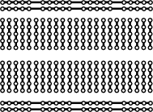

# Introducción a la Electrónica y Fundamentos de Arduino

Este documento recoge los conceptos fundamentales de electricidad, componentes pasivos y activos, uso de la protoboard y arquitectura básica de Arduino necesarios antes de montar y programar cualquier circuito práctico.

---

## 1. Magnitudes Eléctricas Fundamentales

Para entender el comportamiento de cualquier circuito electrónico, es necesario comprender la interacción entre sus tres magnitudes esenciales:

* **Tensión o Voltaje ($V$):** Es la diferencia de potencial eléctrico entre dos puntos, equivalente a la "fuerza" o "presión" que empuja a los electrones a través de un conductor. Se mide en **Voltios (V)**. En Arduino UNO, los niveles de tensión de trabajo estándar son **5 V** y **3,3 V**.
* **Intensidad o Corriente ($I$):** Representa el caudal o volumen de electrones que atraviesa una sección del conductor por unidad de tiempo. Se mide en **Amperios (A)** o **miliamperios (mA)** ($1\text{ A} = 1000\text{ mA}$).
* **Resistencia ($R$):** Es la oposición o dificultad que presenta un material al paso de la corriente eléctrica. Se mide en **Ohmios ($\Omega$)**, **Kiloohmios (k$\Omega$)** o **Megaohmios (M$\Omega$)**.

### La Ley de Ohm

Relaciona de forma matemática directa las tres magnitudes en un circuito resistivo:

$$V = I \times R$$

Despejando según la variable de interés:

$$I = \frac{V}{R} \qquad R = \frac{V}{I}$$

* **Ejemplo práctico de cálculo (protección de un LED):**
  Un LED estándar rojo produce una caída de tensión típica de aproximadamente $2\text{ V}$ y admite una corriente segura de $15\text{ mA}$ ($0,015\text{ A}$). Si la salida digital de Arduino entrega $5\text{ V}$:
  $$\Delta V = V_{fuente} - V_{LED} = 5\text{ V} - 2\text{ V} = 3\text{ V}$$
  $$R = \frac{\Delta V}{I} = \frac{3\text{ V}}{0,015\text{ A}} = 200\,\Omega$$
  Se escoge el valor comercial estándar superior más cercano: **220 $\Omega$**.

---

## 2. Componentes Básicos del Kit

### 2.1 Resistencias fijas
Limitan el flujo de corriente para proteger componentes sensibles o fijar niveles lógicos. Carecen de polaridad. Su valor nominal se codifica mediante bandas de color en su encapsulado:
* **4 Bandas:** 1ª cifra, 2ª cifra, Multiplicador y Tolerancia.
* **5 Bandas (alta precisión):** 1ª cifra, 2ª cifra, 3ª cifra, Multiplicador y Tolerancia.

Para calcular el valor de una resistencia a partir de sus bandas de color, consulta la [Tabla de Bandas de Colores](Resistencias.md#tabla-de-bandas-de-colores) o utiliza una [calculadora online](Resistencias.md#calculadoras-online).

### 2.2 Diodos LED (Light Emitting Diode)
Semiconductores que emiten luz al paso de la corriente eléctrica. **Tienen polaridad obligatoria**:
* **Ánodo (+):** Terminal positivo, reconocible por la patilla más larga.
* **Cátodo (-):** Terminal negativo, patilla más corta y chaflán plano en el borde plástico.
* *Regla fundamental:* Siempre deben ir acompañados de una resistencia en serie (habitualmente $220\,\Omega$ o $1\,\text{k}\Omega$) para evitar su destrucción inmediata por sobrecorriente.

### 2.3 Pulsadores y configuraciones lógicas
Al conectar un botón a una entrada digital, no basta con dejarlo al aire cuando está abierto; los pines digitales de alta impedancia quedan "flotantes" y captan ruido electromagnético. Se requieren resistencias de referencia:
* **Pull-Up:** Mantiene el pin en nivel lógico alto ($5\text{ V}$) por defecto; al pulsar se conecta a masa ($0\text{ V}$).
* **Pull-Down:** Mantiene el pin a masa ($0\text{ V}$) por defecto; al pulsar se conecta a $5\text{ V}$.

### 2.4 Sensores analógicos y divisores de tensión
Sensores resistivos como la fotorresistencia (LDR) o fotodiodos varían su resistencia interna según el entorno físico. Para que el conversor analógico-digital de Arduino pueda leer dicha variación, se implementa un **divisor de tensión**:

$$V_{out} = V_{in} \times \frac{R_2}{R_1 + R_2}$$

---

## 3. Uso y Estructura de la Protoboard

La protoboard (placa de pruebas) permite interconectar componentes sin necesidad de soldar:

* **Buses de alimentación (laterales):** Dos columnas longitudinales marcadas generalmente en rojo ($+$) y azul/negro ($-$). Están unidas internamente de forma vertical continua a lo largo de toda la placa. Se conectan habitualmente a los pines `5V` y `GND` de Arduino.
* **Pistas de trabajo (centrales):** Distribuidas en filas horizontales numeradas (ej. 1 a 60) divididas por una ranura central. Todos los orificios de una misma fila (a-b-c-d-e) comparten conexión eléctrica interna. Los orificios f-g-h-i-j forman otra pista unida e independiente al otro lado de la ranura.
* **Canal central:** Separa físicamente ambos bloques y está diseñado para insertar circuitos integrados en formato DIP (como el registro de desplazamiento 74HC595) sin cortocircuitar sus patillas opuestas.


---

## 4. Arquitectura de Arduino UNO

La placa Arduino UNO integra el microcontrolador ATmega328P y los circuitos auxiliares de alimentación y comunicación serie USB.

### 4.1 Distribución de Pines

* **Pines de Alimentación:**
  * `5V` y `3.3V`: Salidas de tensión regulada para alimentar sensores y módulos.
  * `GND`: Tierra común (referencia a $0\text{ V}$).
  * `VIN`: Entrada para alimentación externa no regulada (7 V a 12 V) alternativa al conector Jack DC.
* **Pines Digitales (0 al 13):**
  * Pueden configurarse como entradas (`INPUT`) o salidas (`OUTPUT`) de dos estados: `HIGH` ($5\text{ V}$) o `LOW` ($0\text{ V}$).
  * Cada pin admite un máximo absoluto de **40 mA** (recomendado $\le 20\text{ mA}$).
  * **PWM (~):** Los pines marcados con virgulilla (`3`, `5`, `6`, `9`, `10`, `11`) simulan salidas analógicas mediante Modulación por Ancho de Pulsos (*Pulse Width Modulation*), variando su ciclo de trabajo de 0 a 255.
* **Pines Analógicos (A0 al A5):**
  * Entradas conectadas a un Conversor Analógico-Digital (ADC) de 10 bits.
  * Mapean un rango de voltaje de entrada de $0\text{ V}$ a $5\text{ V}$ en una escala entera de **0 a 1023** ($2^{10}$ niveles discretos).
  * También pueden funcionar como pines digitales estándar si el proyecto lo requiere.

---

## 5. Estructura Básica del Código en Arduino (C/C++)

Cualquier programa o *sketch* para Arduino requiere obligatoriamente dos funciones principales:

```cpp
// 1. Declaración global: variables, constantes e inclusión de librerías
const int ledPin = 13;

void setup() {
  // 2. Configuración inicial: se ejecuta UNA sola vez al encender o reiniciar
  pinMode(ledPin, OUTPUT);      // Define el modo del pin (INPUT, OUTPUT o INPUT_PULLUP)
  Serial.begin(9600);           // Inicializa la comunicación serie por USB a 9600 baudios
}

void loop() {
  // 3. Bucle principal: se ejecuta de forma repetitiva e infinita
  digitalWrite(ledPin, HIGH);   // Pone el pin en 5V
  delay(1000);                  // Pausa la ejecución por 1000 milisegundos (1 segundo)
  digitalWrite(ledPin, LOW);    // Pone el pin en 0V
  delay(1000);
}
```

## 6. Reglas de Seguridad en el Taller de Prototipado
1. **Desconectar la alimentación:** Modificar o manipular conexiones sobre la protoboard siempre con el cable USB o la batería desconectados de la placa.
2. **Antes de alimentar un circuito:** Comprobar que todos los componentes que requieren resistencia(LED, fotodiodos, etc.) la tengan correctamente instalada. Si dudas, pregunta antes de encender.
3. **Evitar cortocircuitos:** Comprobar que ningún cable puente o pata de componente una de forma directa los terminales 5V y GND.
4. **Respetar tensiones lógicas:** Los pines de Arduino UNO operan a 5 V. Módulos sensibles que funcionen a 3,3 V (como el lector RFID-RC522) requieren alimentación estricta a esa línea para evitar daños permanentes.
5. **Cargas inductivas y de potencia:** Motores paso a paso, relés mecánicos o servomotores generan picos de corriente inductiva; nunca deben alimentarse directamente desde los pines de control digital del microcontrolador, requiriendo módulos drivers dedicados (como el ULN2003 o transistores).   