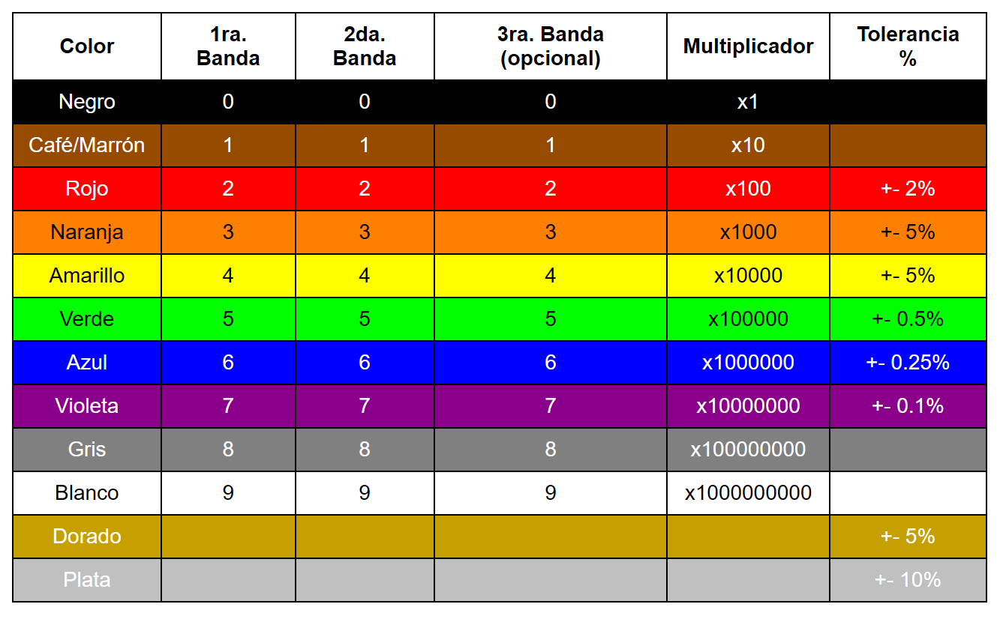
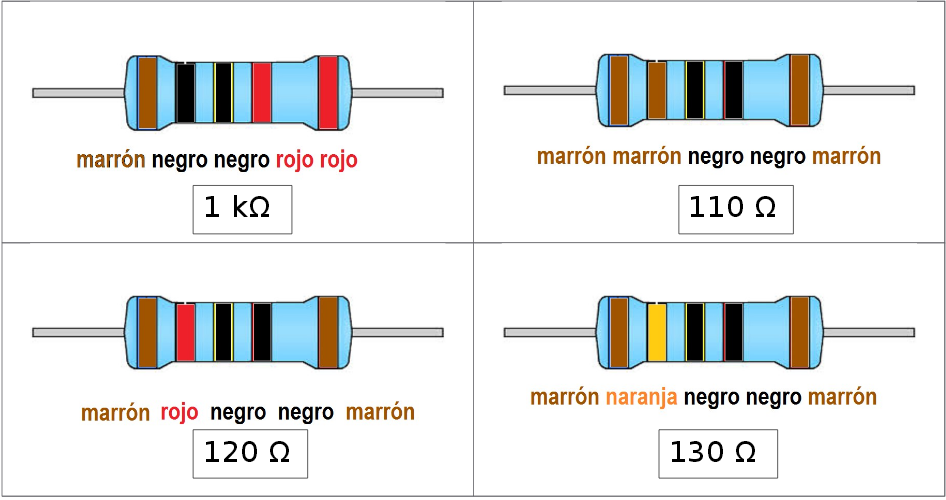

# Resistencias
## Tabla de Bandas de Colores

## Ejemplos de Valores de Resistencias

## Calculadoras online
https://www.digikey.es/es/resources/conversion-calculators/conversion-calculator-resistor-color-code?srsltid=AU7gw4UH-YUl1ceQPPztpJqoBHHVzpA7eH5QqVUu0SPUILIR5aubT-mI

https://www.inventable.eu/paginas/ResCalculatorSp/ResCalculatorSp.html

## Medidor de resistencias
[Medidor de resistencias con Arduino](Arduino-Projects\Medidor-Resistencias)