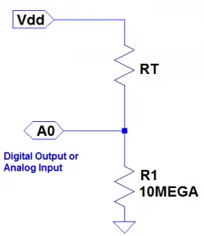
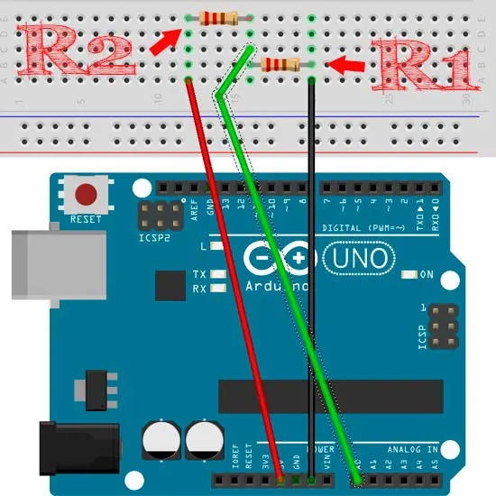

# Medidor de Resistencias u óhmetro

En este proyecto aprenderemos cómo medir resistencias desconocidas usando Arduino. Existe un método sencillo para calcular la resistencia desconocida. Para ello, se usarán dos resistencias, una de ellas de 1000 ohmios y la segunda es una resistencia desconocida. La segunda resistencia se mide usando la regla del divisor de tensión.

### Regla del divisor de tensión
La regla del divisor de tensión se utiliza para resolver circuitos y así simplificar la solución. Aplicar esta regla también puede resolver circuitos simples a fondo. El concepto principal de esta regla del divisor de tensión es: "La tensión se divide entre dos resistencias que están conectadas en serie en proporción directa a su resistencia.

## Componentes necesarios
* Arduino UNO
* Protoboard
* Resistencia conocida ($R1 = 1000\Omega$). Se puede usar una resistencia de otro valor, pero se debe cambiar el valor de la variable R1 en el código de Arduino.
* Resistencia desconocida ($R2$)
* Cables de conexión

* Arduino IDE instalado

## Explicación

En Arduino lo que realmente vamos a medir es una señal de tensión analógica. Vamos a emplear un simple divisor de tensión entre la resistencia de valor desconocido y nuestra resistencia conocida.

**Esquema básico de un divisor de tensión:**




**Fórmula del divisor de tensión:**

$Vdd = V(A0) + R2/(R1 + R2)$

**Como medir la resistencia:**

Vdd es la tensión de alimentación (5V) y R1 tiene un valor de 1000 ohmios y R2 se calcula en función del valor leído por la entrada analógica AO

$R2 = (V(A0) * 1000\Omega/5V) – 1000\Omega$

## Código de Arduino
Ejecuta el siguiente código en tu Arduino para medir la resistencia desconocida. Asegúrate de conectar la resistencia desconocida y la resistencia conocida en serie, y conectar el punto medio al pin A0 del Arduino. Para ver los resultados, abre el monitor serial en el IDE de Arduino.

```cpp
int PinA0= 0;
int lectura= 0;
int Vdd= 5; // voltaje de alimentación
float Va0= 0; // voltaje a medir
float R1= 1000; // resistencia conocida
float R2= 0; // resistencia desconocida
float relacion= 0;

void setup()
{
    Serial.begin(9600);
}
void loop() {
    lectura= analogRead(PinA0);
    if(lectura) {
        relacion= lectura * Vdd;
        Va0= (relacion)/1024.0;
        relacion= (Vdd/Va0) -1;
        R2= R1 * relacion;
        Serial.print("Vout: ");
        Serial.println(Va0);
        Serial.print("R2: ");
        Serial.println(R2);
        delay(1000); // se mide el valor de la resistencia cada 1 segundo
    }
}
```

## Referencias
https://eloctavobit.com/proyectos-tutoriales-arduino/medir-el-valor-de-una-resistencia-con-Arduino

https://www.instructables.com/Arduino-Resistance-Measurement/