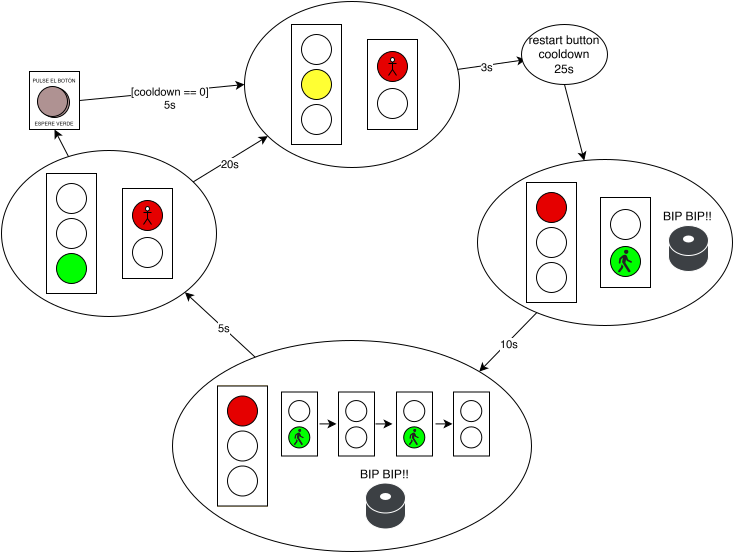
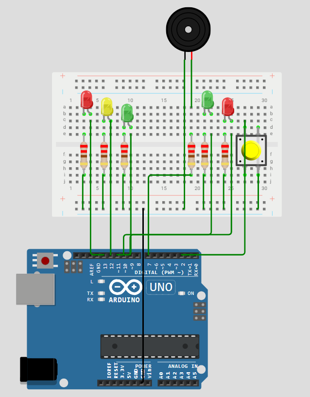

# Semáforo

En este proyecto, haremos dos semáforos: uno para vehículos y otro para peatones. El semáforo de vehículos tendrá tres luces: roja, amarilla y verde, mientras que el semáforo de peatones tendrá dos luces: roja y verde.

## Explicación y requisitos

Como todos sabemos, sería muy peligroso que los vehículos y los peatones tuvieran luz verde al mismo tiempo, por lo que el semáforo de peatones se encenderá en verde cuando el semáforo de vehículos esté en rojo. Además, el semáforo de vehículos tendrá una luz amarilla antes de cambiar a rojo, para advertir a los conductores que deben detenerse. 

Queremos, que además, el semáforo de vehículos tenga un botón que, al presionarlo, haga que el semáforo de peatones se ponga en verde y el de vehículos en rojo (no instantáneamente), para que los peatones puedan cruzar la calle.

Podría ocurrir que la calle esté vacía y que no haya peatones, por lo que es interesante que la mayor parte del tiempo el semáforo de vehículos esté en verde y el de peatones en rojo. Sin embargo, si de repente no paran de venir peatones de forma continuada, el botón del semáforo de peatones se presionaría sin parar. Para evitar que el semáforo de vehículos esté en rojo durante mucho tiempo, se establecerá una cuenta atrás o *cooldown*, durante la cual el semáforo de vehículos seguirá en verde aunque se haya presionado el botón.

Por último, el semáforo de peatones debe emitir un pitido cuando se encienda la luz verde, para avisar a los peatones que pueden cruzar la calle.

## Diagrama de estados



En este diagrama de estados, podemos ver el comportamiento del sistema. Si nadie presiona el botón, el sistema cambiará de estados cada cierto tiempo. Si alguien presiona el botón, el sistema adelantará el cambio de luces, pero solo si ha pasado el tiempo de *cooldown*. De lo contrario, el sistema seguirá en verde para los vehículos y en rojo para los peatones hasta que pase el tiempo de *cooldown*, por lo que los peatones deberán esperar un poco más.

## Componentes necesarios

* Arduino UNO
* Protoboard
* Cables de conexión
* LEDs: 3 rojos, 2 verdes y 1 amarillo
* Resistencias: 6 de 220 ohmios (para los LEDs)
* Botón
* Buzzer o zumbador

* Arduino IDE instalado

## Conexiones Arduino



Como podemos ver, el botón no lleva resistencia, ya que se ha configurado como `INPUT_PULLUP` en el código de Arduino. Esto significa que el pin del botón estará en estado alto (HIGH) cuando no esté presionado y en estado bajo (LOW) cuando esté presionado.

Se proporciona también el proyecto en Wokwi para poder simularlo sin necesidad de tener los componentes físicos. Se puede acceder a él desde el siguiente enlace: [Simulación de Semáforo en Wokwi](./semaforo_wokwi.zip).

## Código de Arduino

```cpp
int greenCarsPin = 13;
int yellowCarsPin = 12;
int redCarsPin = 11;
int greenPeoplePin = 10;
int redPeoplePin = 9;
int buttonPeoplePin = 2;
int buzzerPin = 7;

// Variables de tiempo
unsigned long tiempoInicioVerdeCoches = 0; // Controla los 20s automáticos
unsigned long tiempoUltimoPase = 0;        // Controla el cooldown del botón de 25s
const unsigned long tiempoAutoVerde = 20000; // 20 segundos automáticos
const unsigned long cooldown = 25000;        // 25 segundos de cooldown para el botón

void setup()
{
    Serial.begin(9600);
    pinMode(greenCarsPin, OUTPUT);
    pinMode(yellowCarsPin, OUTPUT);
    pinMode(redCarsPin, OUTPUT);
    pinMode(greenPeoplePin, OUTPUT);
    pinMode(redPeoplePin, OUTPUT);
    pinMode(buttonPeoplePin, INPUT_PULLUP);
    pinMode(buzzerPin, OUTPUT);

    // Estado inicial: coches pasando
    vehiculosPasan();
    tiempoInicioVerdeCoches = millis();
}

void loop()
{
    unsigned long tiempoEnVerde = millis() - tiempoInicioVerdeCoches;
    unsigned long tiempoDesdePase = millis() - tiempoUltimoPase;
    bool cooldownListo = (tiempoDesdePase >= cooldown);
    //Serial.print("Cooldown:");
    //Serial.println(cooldown - tiempoDesdePase);
    // Caso 1: Alguien pulsa el botón y el cooldown ha llegado a 0
    if (digitalRead(buttonPeoplePin) == LOW && cooldownListo)
    {
        Serial.println("Botón pulsado: transición peatonal en 1s");
        delay(1000); // 1s
        cambiarASemaforoPeatones();
    }
    // Caso 2: Nadie pulsa, pero vencen los 20 segundos automáticos
    else if (tiempoEnVerde >= tiempoAutoVerde)
    {
        Serial.println("Paso automático por tiempo (20s)");
        cambiarASemaforoPeatones();
    }
}

void cambiarASemaforoPeatones()
{
    // 1. Aviso a vehículos (amarillo 3 s)
    vehiculosAviso();
    delay(3000);

    // Reinicia el contador de cooldown para el botón (25s)
    tiempoUltimoPase = millis();

    // 2. Peatones pasan (verde peatones y zumbador 10 s)
    peatonesPasan();
    delay(10000);

    // 3. Aviso a peatones (verde intermitente y pitidos 5 s)
    peatonesAviso();

    // 4. Volver a abrir el tráfico para los coches
    vehiculosPasan();
    
    // Reinicia el contador de los 20s automáticos para los coches
    tiempoInicioVerdeCoches = millis();
}

void vehiculosPasan() {
    digitalWrite(redCarsPin, LOW);
    digitalWrite(yellowCarsPin, LOW);
    digitalWrite(greenPeoplePin, LOW);
    noTone(buzzerPin);
    
    digitalWrite(greenCarsPin, HIGH);
    digitalWrite(redPeoplePin, HIGH);
}

void vehiculosAviso() {
    digitalWrite(greenCarsPin, LOW);
    digitalWrite(yellowCarsPin, HIGH);
}

void peatonesPasan() {
    digitalWrite(yellowCarsPin, LOW);
    digitalWrite(redCarsPin, HIGH);
    digitalWrite(redPeoplePin, LOW);
    digitalWrite(greenPeoplePin, HIGH);
    tone(buzzerPin, 294);
}

void peatonesAviso() {
    for (int i = 0; i < 5; i++)
    {
        digitalWrite(greenPeoplePin, HIGH);
        tone(buzzerPin, 294);
        delay(500);
        digitalWrite(greenPeoplePin, LOW);
        noTone(buzzerPin);
        delay(500);
    }
}
```

## Problemas de esta implementación

* Podría ocurrir que, quedando tan solo 0.5 segundos para el cambio a amarillo automático, alguien pulse el botón. En ese caso, en lugar de esperar 0.5 segundos, esperaría 1s.
* Inicialmente, el cooldown empieza en 25, por lo que al arrancar el sistema, la funcionalidad del botón no estará disponible hasta que pasen 25 segundos. Esto se puede solucionar inicializando la variable `tiempoUltimoPase` a un valor negativo, por ejemplo `-cooldown`, para que el primer paso de peatones pueda ocurrir inmediatamente:
```cpp
// Se inicializa a -25000 para poder pulsar el botón desde el principio en la primera iteración
unsigned long tiempoUltimoPase = -25000;
```

## Aplicación real

En la realidad, este sistema es menos complejo. Algunos semáforos funcionan de forma automática, sin tener un botón para peatones. Simplemente los peatones esperan a que les toque su turno para cruzar. Otros semáforos de peatones funcionan con un botón, pero únicamenet se ponen en verde cuando alguien pulsa el botón, no de forma automática cada cierto tiempo. Se puede simplificar esta práctica eligiendo entre una u otra configuración. 

## Ampliación del proyecto

Se puede añadir un decodificador de 7 segmentos para mostrar el tiempo restante para que cambie la luz del semáforo, tanto para vehículos como para peatones. Esto permitirá a los conductores y peatones saber cuánto tiempo tienen antes de que cambie la luz.

## Referencias
https://eloctavobit.com/proyectos-tutoriales-arduino/proyecto-semaforo-con-arduino

https://www.geekfactory.mx/tutoriales-arduino/boton-o-pulsador-con-arduino/?srsltid=AU7gw4WzZ6MbZ87Bkk6kpgXbfD9McKefAqnVK5pPm7D4QAR9E4Vypv5A